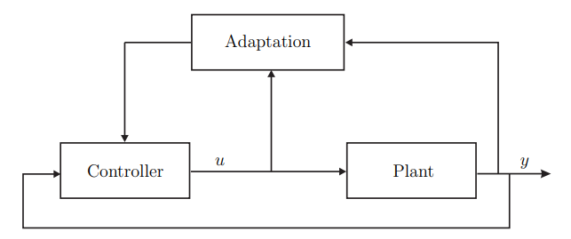

# Introduction

Before delving into the content of non-linear and adaptive control, we need to clarify some concepts:

- Non-linear system: a system that contains non-linear factors, such as exponential polynomials, logarithms, sine, or cosine functions.
- Adaptive: possessing the capacity or tendency to adapt.

Now, we can explore the content of this section. Adaptive control aims to model and control uncertainties, encompassing the presence of unknown parameters in the plant model. To achieve this, we should utilize concepts from non-linear controllers, such as stability validation.

### Motivation Example

**Example 1** - Regulation ($x(t) \rightarrow 0$ as $t \rightarrow \infty$)

Let's consider the scalar system initially:

$$\dot{x} = \theta x + u$$

where $x$ is state, $u$ is control and $\theta$ is an unknown parameter.

*Note:* In adaptive control, there isn't consistent notation; it's possible to use $\theta$, $\theta^\ast $, $p^\ast $, or various other symbols.

Now, let's outline methods to regulate the system based on the value of $\theta$.

1. If $\theta < 0$

    In this scenario, the system regulation is achievable by setting the action $u \equiv 0$.

2. If $\theta > 0$

    Here, applying a feedback law helps regulate the system:

    $$u = -(\theta + 1)x \Rightarrow \dot{x} = -x$$

    *Note:* Any positive number can replace the +1.

3. If $\theta$ is unknown

    In such cases, we will employ the adaptive control law to demonstrate its functionality.

    $$\dot{\hat{\theta}} = x^2$$

    $$u = -(\hat{\theta} + 1)x$$

    $$\therefore \dot{x} = (\theta - \hat{\theta} - 1)x$$

    *Note:* Here, $\hat{\theta}$ represents the estimation of the unknown parameter, and we can define the error between the real and estimated parameter as $\tilde{\theta} = \hat{\theta} - \theta$.

    This formulation allows us to attempt finding a Lyapunov Function to ensure the stability of this controller.

    Initially, the Lyapunov function should involve both states of the closed-loop system ($x$ and $\hat{\theta}$):

    $$V(x, \hat{\theta}) := \frac{x^2}{2} + \frac{(\hat{\theta} - \theta)^2}{2}$$

    $$\dot{V} = (\theta - \hat{\theta} - 1)x + (\hat{\theta} - \theta)x^2 = -x^2$$

    The selection of the $V$ function is based on the aim of achieving an asymptotically stable equilibrium at $x=0, \hat{\theta}=\theta$. However, the control objective doesn't explicitly necessitate $\hat{\theta} \rightarrow \theta$.

    Using the function $V$ and $\dot{V}$, we can apply the Lyapunov theorem to analyze the stability of this system.

    Concluding the example, the system is just stable as $\dot{V} = 0$ when $x=0$, and $\hat{\theta}$ arbitrary.    

**Theorem 1 (Lyapunov)**

Let $V$ be a positive definite $C^1$ function

- If  $\dot{V} \leq 0$ everywhere, then the system is stable.
- If $\dot{V} < 0$ everywhere (except at the equilibrium being studied), then the system is asymptotically stable.
- If $V$ is also radially unbounded ($V \leftarrow \infty$ along any direction), then the system is globally asymptotically stable.

### Conclusion

1. Even though the plant is lenar, the control is non-linear.

2. The control law is dynamic as it incoporates the tuning equation for $\hat{\theta}$

3. We can think of the tuning law in the above example as an adaptation block in the overall system.

