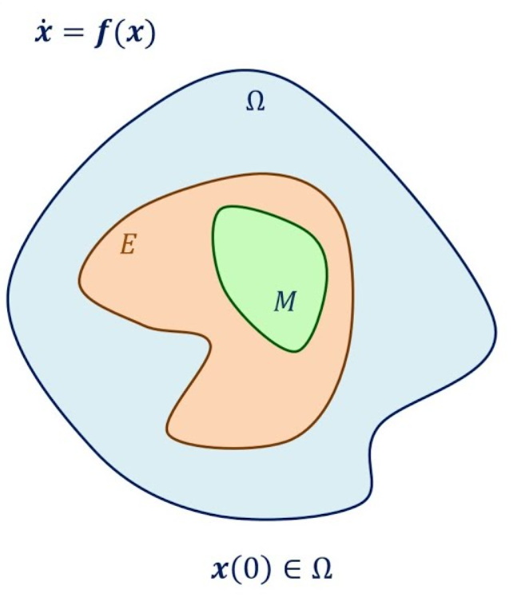

# Weak Lyapunov Functions

Consider the general system

$$\dot{x} = f(x)$$

where $x \in \mathbb{R}^n$ and we assume that $f : \mathbb{R}^n \rightarrow \mathbb{R}^n$ is sufficiently regular so that solutions of the system exist and are unique.

Let $V$ be a $C^1$ function from $\mathbb{R}^n$ to $[0, \infty)$, called candidate Lyapunov functions. It's derivative along solutions is defined as

$$\dot{V}(x) :=  \frac{\partial V}{\partial x} \cdot f(x)$$
**Theorem 2 (LaSalle's invariance principle)**

- Let $\Omega$ be a compact set tat is positively invariant with respect to $\dot{x} = f(x)$.
- Let $V$ be a continuously differentiable function on $\Omega$ such that $\dot{V}(x) \leq 0$ in $\omega$
- Let $E \subset \Omega$ be the set of all points in $\Omega$ such that $\dot{V}(x) = 0$
- Let M be the largest positively invariant set in $E$

Then, every solution starting in $\Omega$ approaches $M$ as $t \rightarrow \infty$.

    

**Theorem 3 (Barbalat's Lemma)**
Suppose that for some nonnegative definite continuous function $W$ we have

$$\dot{V}(x) \leq -W(x) \leq 0 \;\; \forall x$$

Let $x(t)$ be bounded and let it's derivative $\dot{x}(t)$ also be bounded. Let $W$ be a continuos function of $x$ such that the integral

$$\int_0^\infty W(x(s))ds=  L,\;\; |L| < \infty$$
So,

$$\lim_{t \rightarrow \infty} W(x(s)) = 0$$

With that we can invoke the condition that $\dot{x}$ is bounded, then we can indeed show rigorously that we should have convergence.