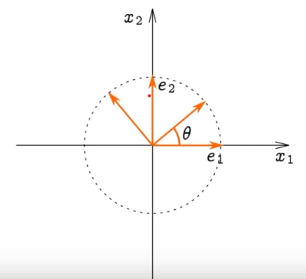
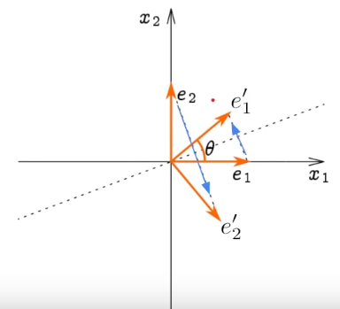

# Matrix Properties

### Transpose of a Matrix

- If $\mathbf{A} \in \mathbb{R}^{m \times n}$, then $\mathbf{A^T} \in \mathbb{R}^{n \times m}$.
- The columns of $\mathbf{A}$ are the rows of $\mathbf{A^T}$, and the rows of $\mathbf{A}$ are the columns of $\mathbf{A^T}$.

$$\mathbf{A} = \begin{bmatrix}
a_{11} & a_{12} & \cdots & a_{1n} \\
a_{21} & a_{22} & \cdots & a_{2n} \\
\vdots & \vdots & \ddots & \vdots \\
a_{m1} & a_{m2} & \cdots & a_{mn}
\end{bmatrix} \text{ } \mathbf{A^T} = \begin{bmatrix}
a_{11} & a_{21} & \cdots & a_{m1} \\
a_{12} & a_{22} & \cdots & a_{m2} \\
\vdots & \vdots & \ddots & \vdots \\
a_{1n} & a_{2n} & \cdots & a_{mn}
\end{bmatrix}$$

### Range and Rank

- The **range** of a matrix is the span of its columns.

$$\mathbf{A} \in \mathbb{R}^{m \times n}$$

$$\textbf{range}(\mathbf{A}) = \{ \mathbf{Ax \; | \; x \in \;} \mathbb{R}^n \} \subseteq  \mathbb{R}^m$$

- The **rank** of a matrix is the dimension of its range.

$$\textbf{rank}(\mathbf{A}) = \textbf{dim range}(\mathbf{A})$$

- If $\mathbf{A} \in \mathbb{R}^{m \times n}$ and $\textbf{rank}(\mathbf{A}) = \mathbb{R}^m$, then we say $\mathbf{A}$ is onto.

- If $\mathbf{A}$ is onto, $\textbf{range}(\mathbf{A})$ contains all possible m-vectors.

- If $\mathbf{A}$ os onto, the columns of $\mathbf{A} \textbf{ span } \mathbb{R}^m$.

- If $\mathbf{A}$ is onto, the rows of $\mathbf{A}$ are independent.

- **Rank facts**
    - $\textbf{rank} (\mathbf{A})$ is the number of independent columns.
    - $\textbf{rank} (\mathbf{A})$ = $\textbf{rank} (\mathbf{A^T}$).
        - Row rank and column rank are always the same for any matrix.
        - Number of independent row vectors is always equal to number of independent column vectors.
    - For any $\mathbf{A} \in \mathbb{R}^{m \times n}$, we have  $\textbf{rank} (\mathbf{A}) \leq \textbf{min}(m, n)$.
        - If $\textbf{rank} \mathbf{(A)} = \textbf{min}(m, n)$, we say the matrix is full rank.

### Nullspace

- The **nullspace** of a matrix is the set of input vectors that get mapped to zero.

- Equivalently, the nullspace is the set of vectors orthogonal to all rows of the matrix.

$$\textbf{null} (\mathbf{A}) = \{  \mathbf{x} \in \mathbb{R}^n \; | \; \mathbf{Ax} = 0 \}$$

- **Visual intuition**
    - Let $\mathbf{A} \in \mathbb{R}^{m \times n}$.
    - Draw the $\textbf{span}$ of the columns of the matrix $\mathbf{A}$. You'll end up with a subspace of m-dimensional space.
    - Look at the origin of this subspace; this is the zero vector in m-dimensional space.
    - The **nullspace** is the set of all coefficients that make the $n$ column vectors sum to zero.

### Orthogonality

- A set of vectors is **orthogonal** if the dot product between any two of them is zero.

### Normalized vectors

- A **normalized** vector is a vector whose norm is one.

### Orthonormal vectors

- A se of orthogonal, normalized vectors is said to be **orthonormal**.

- **Some properties**
    - An orthonormal set of vectors is independent
    - If we take an orthonomal set of $k$ vectors and arrange them as the columns of a matrix $\mathbf{U}$, then $\mathbf{U^T}\mathbf{U} = \mathbf{I_k}$.

### Orhogonal matrices

- An **orthogonal** matrix is a square matrix $\mathbf{U}$ that satisfies $\mathbf{U^T}\mathbf{U} = \mathbf{I}$.
    - Orthogonal matrices have orthonormal columns.

- Let $\mathbf{U} \in \mathbb{R}^{m \times n}$. Since the $n$ column vectors of $\mathbf{U}$ are independent, and each column vector has $n$ elements, we know they span $\mathbb{R}^n$.

- The columns of an orthogonal matrix $\mathbf{U} \in \mathbb{R}^{n \times m}$ form a **basis** for $\mathbb{R}^n$. 

- Orthogonal matrices preserve lenghts and angles, and so are said to be **isometric**.

### Rotational matrices

$$\begin{bmatrix}
\cos{\theta} & -\sin{\theta} \\
\sin{\theta} & \cos{\theta} \\
\end{bmatrix} $$

    

### Reflection matrices

$$\begin{bmatrix}
\cos{\theta} & \sin{\theta} \\
\sin{\theta} & -\cos{\theta} \\
\end{bmatrix} $$

    

